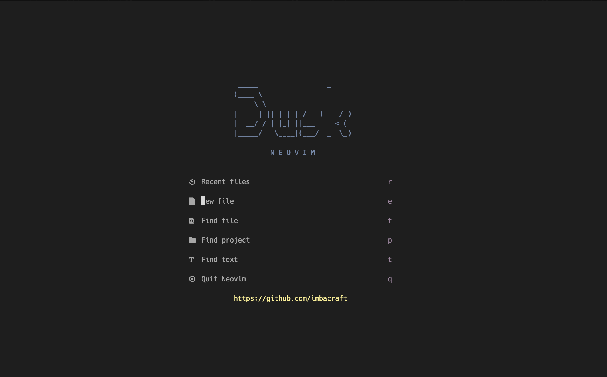
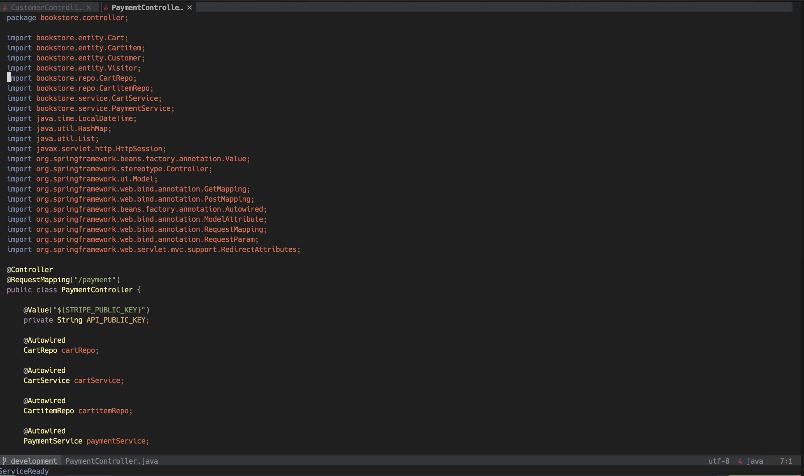
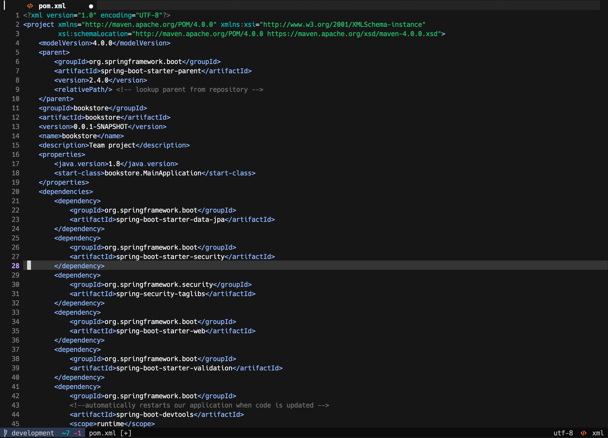

# Dusk Neovim

Dusk.nvim is a blazing fast Lua config suited for Full-stack Java development.

Optimized with Spring Boot && Angular projects in mind.

## Showcase





## Design Philosophy

Dusk.nvim is designed to be: 
- minimal (~1500 lines of code in total) 
- functional (has almost all the features you expect from your IDE)
- performant (~70-80ms startup time on modern hardware)
- Out-of-the-box complete. Works with installation.
- Not opinionated. Defaults are always preferred.

## Features

- Native LSP and autocompletion
- Syntax highlighting via nvim-treesitter
- Java code runner with jaq
- Java Unit Testing with vscode-java-test
- Java Debugging via nvim-dap
- Git integration with LazyGit
- Explore files via nvim-tree
- Fuzzy finder via Telescope
- Notes with Markdown
- Blazing fast performance

## Colorschemes

Supported colorschemes are:

1. Default - [Vscode](https://github.com/Mofiqul/vscode.nvim).
2. [Nightfox](https://github.com/EdenEast/nightfox.nvim)

Feel free to add your own colorschemes.
Most colorschemes will be compatible with Dusk.

## Dependencies

For Dusk.nvim to perform as intended, you need to have the following dependencies installed:

1. Neovim version >= 0.9.5
2. Git 2.23+
3. Ripgrep for telescope
4. fd for telescope
5. Nodejs
6. Neovim node client (npm install -g neovim) - [neovim/node-client](https://github.com/neovim/node-client)
7. "zig", "clang", or "gcc" executables to be able to compile treesitter parsers (check your package manager for one of these)
8. Treesitter-cli nodejs module (Check your package manager for a treesitter or treesitter-cli package)
9. Java 17+ (for Java LSP server)
10. A font with nerdfont icons (my suggestion: <https://github.com/ryanoasis/nerd-fonts/tree/master/patched-fonts/Hack>)
11. LazyGit if you are going to use it inside neovim.

NOTE: Run :checkhealth command to see what other dependencies you might be missing and to receive help if you have problems with installation.

## Installation

| Platform | Supported |
| :------: | :-------: |
| Windows  |    ✅     |
|  macOS   |    ✅     |
|  Linux   |    ✅     |

1. Make sure to remove or move your current `nvim` directory (`~/.config/nvim`), if it exists.
2. `git clone https://github.com/imbacraft/dusk.nvim`
3. Copy or Move the `nvim` folder from the cloned dusk.nvim project (not the dusk.nvim folder!) to your `~/.config/` folder.
   In the end, your folder should look like this: `~/.config/nvim`. Please note, depending on your OS, neovim might search for configuration in a different folder. In this case, run the `:checkhealth` command inside neovim, to see where it looks for configuration and place the nvim folder inside that.
4. Run the `nvim` command and wait for the plugins to be installed.
5. If some plugins fail to install at this point, don't be alarmed. Enter the `:qa!` command to exit neovim.
6. Re-run the `nvim` command and enter `SPC p s` to update the package manager.
7. Now all the plugins should have been installed. If some have not, run the `:checkhealth` command and check the dependencies section above to see what you might be missing.
8. Happy editing!

## State of Java experience

Dusk.nvim provides a java development experience with the following advantages:

- Eclipse level editing and refactoring capabilities in neovim
- Autocomplete candidates from the current buffer, which includes comments
- Superb coding navigation - searches references in decompiled sources also
- Support for running and debugging applications with JVM Args (including Spring active profiles)
- Execute and debug test methods and classes

Features curently not supported (these are what you will miss from your IDE - but also shows the room for improvement):

- No option for running all tests in test resource folders
- No support for editing many projects in the same neovim instance. Right now for each project you should open new neovim instance.
- Referenced external libraries not available in file explorer tree
- Refactoring of java packages and filenames not supported

## Java Multiple Runtimes

In jdtls.lua, you will find the following snippet. 
Here you can configure your multiple java runtimes.

Example:

```lua
            settings = {
              java = {
                configuration = {
                  runtimes = {
                     {
                      name = "JavaSE-1.8",
                      path = "/Library/Java/JavaVirtualMachines/jdk1.8.0_291.jdk/Contents/Home",
                     },
                     {
                      name = "JavaSE-11",
                      path = "/opt/homebrew/Cellar/openjdk@11/11.0.18/libexec/openjdk.jdk/Contents/Home",
                      default = true
                     },
                     {
                      name = "JavaSE-19",
                      path = "/opt/homebrew/Cellar/openjdk/19.0.2/libexec/openjdk.jdk/Contents/Home",
                     },
                  }
                }
              }
            }
                
```
