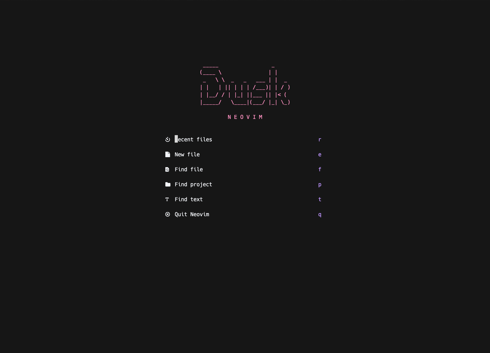

# Dusk Neovim

Dusk is a lightweight, aesthetically minimal Neovim config, written in Lua, able to provide for web and Java development. 

## Showcase




## Design Philosophy

Dusk aims to strike a middle ground between the one-size-fits-all configs, who try to squeeze as much functionality as possible, and super minimal configs such as nyoom.nvim (which is great and you should try it too).
But with a little preference towards minimalism. Like the Dusk, between dark and light, but towards dark!

The goal is to create an IDE experience with exactly the necessary functionalities (no more, no less). 

Dusk is designed against the following principles (inspired by doom-emacs):

- Gotta go fast. Startup and run-time performance are priorities.
- Aesthetic Minimalism. Clutter on the screen is to be avoided.
- Functional completeness. Minimalism does not sacrifice the full necessary functionality of an IDE.
- Intuitive, consistent keybinding. f = find, s = search, b = buffer etc.
- Extensibility. Code base that is understandable and commented where possible, to help you configure it to your needs.
- Close to metal. There's less between you and vanilla neovim by design. That's less to grok and less to work around when you tinker.
- Opinionated, but not stubborn. Dusk is about reasonable defaults and curated opinions, but use as little or as much of it as you like.

I encourage you to try out this config and adjust it to your preferences.

## Highlight Features

- Native LSP
- Syntax highlighting via nvim-treesitter
- Java Unit Testing with vscode-java-test
- Explore files via nvim-tree 
- Fuzzy finder via Telescope
- Zen mode for distraction-free coding.
- Notes with Markdown

## Colorschemes

Supported colorschemes are:

1. All the colorschemes from https://github.com/LunarVim/Colorschemes (default is onedarkest)
2. All base16 themes.
3. Doom-one (port from doom-emacs).
4. Nightfox.
5. oxocarbon-lua.

Change colorscheme while editing by SPC f c.

## Dependencies

1. Neovim version >= 0.7.0
2. Git 2.23+
3. Ripgrep (for telescope)
4. Nodejs (for copilot)
5. Java 11 (for LSP)
6. A font with nerdfont icons (my suggestion: https://github.com/ryanoasis/nerd-fonts/tree/master/patched-fonts/Hack)

NOTE: Run :checkhealth command to see what other dependencies you might be missing.

## Installation

| Platform | Supported |
|:--------:|:---------:|
|  Windows |     ❌    |
|   macOS  |     ✅    |
|   Linux  |     ✅    |

1. Make sure to remove or move your current `nvim` directory (`~/.config/nvim`), if it exists.
2. git clone https://github.com/imbacraft/dusk.nvim
3. Copy or Move the `nvim` folder to `~/.config/` 
4. Run the `nvim` command and wait for the plugins to be installed.
5. Reload `nvim` and run :PackerSync (SPC p s).
6. Ready to go!

## Directory Structure

1. The entry file is `init.lua`. 
2. The `lua` folder contains all the configuration.
3. The `lua.plugins.lua` file defines the plugins to be used. Add or remove plugins here.
4. The `lua.settings` folder contains the neovim settings and keybinds.
5. The `lua.plugins` folder contains the configuration files for all the plugins.
6. The `jars` folder contains the necessary jars for Java debugging and testing. If you want to build them from source yourself, see "Java Debugging and Testing" section.
7. The `ftplugin` folder contains the configuration files for the language servers. Currently only java is configured.

## Credits

Kudos to https://github.com/ChristianChiarulli/nvim for providing the configuration for the Java Language server.

## Miscellaneous

### Java Debugging and Testing

Jars required for Java debugging and testing are included in the jars folder.
But if you want to build them yourself from source, do the following:
```
1. git clone https://github.com/microsoft/java-debug
2. cd java-debug/
3. ./mvnw clean install
```
```
1. https://github.com/Microsoft/vscode-java-test
2. cd vscode-java-test
3. npm install
4. npm run build-plugin
```
### JSON formatting

1. sudo apt install jq in Ubuntu/Debian 
2. sudo dnf install jq on Fedora/RHEL/CentOS
3. brew install jq in macOS
4. Type the vim command: ":%!jq ." on a json file.
5. Json file is formatted.


## Changelog

### 1.00

Release version

### 1.01 (10.07.2022)

1. Introduced keymaps for window navigation
2. Set shiftwidth = 4
3. Don't lazyload telescope
4. Set Telescope find files to search for hidden files also.

### 1.02 (31.07.2022)


1. Removed Surround plugin as unneccesary.
2. Additional keymap for "gcc" to comment.
3. Modified search in buffer and search in Project keymaps (NEW: SPC s b, SPC s p)
4. Updated lsp handlers and null-ls config.

### 1.03 (20.08.2022)

1. Fixed deprecated variables in bufferline.lua.
2. Added SPC SPC keymap for find file (for emacs users).
3. Added SPC f p keymap for find projects.
4. Added SPC b k and K for close current buffer and close all buffers respectively.

### 1.04 (20.09.2022)

1. Added BufOnly plugin for better mass buffer closure performance.
2. Added norg plugin for notes (works only for Neovim version 0.8.0++)
3. Added more ensured installed treesitter parsers (json, javascript, css, typescript, bash, python)

### 1.1 (24.09.2022) - Major update

1. Migrated to mason.nvim (https://github.com/williamboman/mason.nvim/) from nvim-lsp-installer.
2. Added jaq code runner (https://github.com/is0n/jaq-nvim).
3. Changed default colorscheme (from base16-twilight to onedarkest).
4. Added more colorschemes to choose from (nightfox and oxocarbon-lua).
5. Show absolute code line numbers by default.
6. Removed code line indicator from statusline as unneccesary.
7. Cleaned up many keymaps
