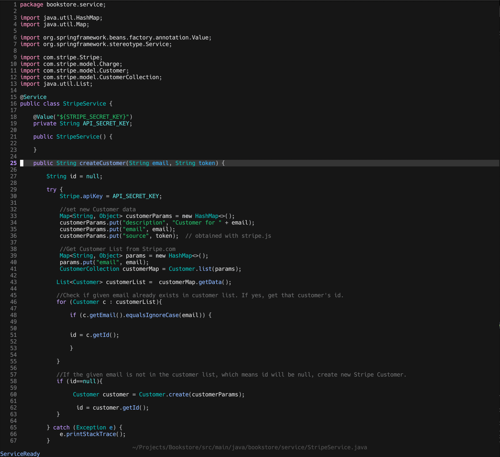

# Dusk Neovim

Dusk is a lightweight minimal neovim config written in lua, oriented for full stack developers, especially java developers.

## Showcase





## Design Philosophy

Dusk aims to strike a middle ground between the one-size-fits-all configs, who try to squeeze as much functionality as possible, and super minimal configs such as nyoom.nvim (which is great and you should try it too).

The goal is to create an IDE experience with exactly the necessary functionalities (no more, no less). 

Dusk is designed according following principles (inspired by doom-emacs):

- Gotta go fast. Startup and run-time performance are priorities.
- Aesthetic Minimalism. Clutter on the screen is to be avoided. No fancy colors either.
- Functional completeness. Minimalism does not sacrifice the full necessary functionality of an IDE.
- Intuitive, consistent keybinding. f = find, s = search, b = buffer etc.
- Extensibility. Code base that is understandable and commented where possible, to help you configure it to your needs.
- Close to metal. There's less between you and vanilla neovim by design. That's less to grok and less to work around when you tinker.
- Opinionated, but not stubborn. Dusk is about reasonable defaults and curated opinions, but use as little or as much of it as you like.

I encourage you to try out this config and adjust it to your preferences.

## Features

## Dependencies

1. Neovim version >= 0.70
2. Git 2.23+
3. Ripgrep (for telescope)
4. Nodejs (for copilot)
5. A font with nerdfont icons (my suggestion: https://github.com/ryanoasis/nerd-fonts/tree/master/patched-fonts/Hack)

## Installation

1. Make sure to remove or move your current `nvim` directory (~/.config/nvim)
2. git clone https://github.com/imbacraft/dusk.nvim ~/.config/nvim
3. Run `nvim` and wait for the plugins to be installed.
4. Reload `nvim` and run :PackerSync (SPC p s).
5. Ready to go!

## Directory Structure

1. The entry file is `init.lua`. 
2. The `lua` folder contains all the configuration.
3. The `lua.plugins.lua` file defines the plugins to be used. Add or remove plugins here.
4. The `lua.settings` folder contains the neovim settings and keybinds.
5. The `lua.plugins` folder contains the configuration files for all the plugins.
6. The `jars` folder contains the necessary jars for Java debugging and testing. If you want to build them from source yourself, see "Java Debugging and Testing" section.
7. The `ftplugin` folder contains the configuration files for the language servers. Currently only java is configured.

## Credits

1. Kudos to https://github.com/ChristianChiarulli/nvim for providing the configuration for the Java Language server.
2. Aesthetics for Dusk were inspired by https://github.com/shaunsingh/nyoom.nvim.
3. Basic configuration files were inspired by https://github.com/LunarVim/Neovim-from-scratch.
4. Folder structure inspired by https://github.com/abyo/nvim-windows.

## Miscellaneous

### Java Debugging and Testing

```
git clone git@github.com:microsoft/java-debug.git
cd java-debug/
./mvnw clean install
```

```
git clone git@github.com:microsoft/vscode-java-test.git
cd vscode-java-test
npm install
npm run build-plugin
```

### JSON formatting

1. sudo apt install jq in Ubuntu/Debian 
2. sudo dnf install jq on Fedora/RHEL/CentOS
3. brew install jq in macOS
4. Type the vim command: ":%!jq ." on a json file.
5. Json file is formatted.
