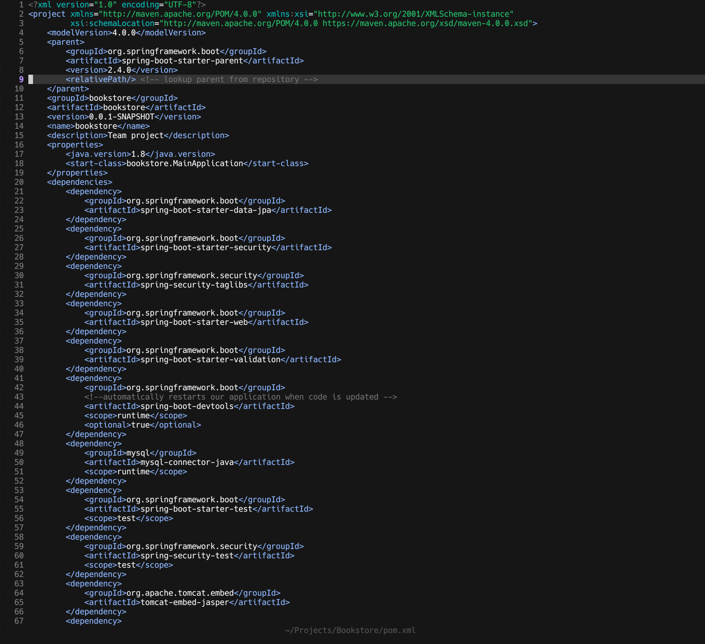

# Dusk Neovim

Dusk is a blazing fast Lua config suited for Full Stack Java development. 

## Showcase




## Design Philosophy

Dusk aims to strike a middle ground between the one-size-fits-all configs, who try to squeeze as much functionality as possible, and minimal configs such as nyoom.nvim. However, it maintains a little preference towards minimalism. Like the Dusk, between dark and light, but towards dark!

The goal is to create an IDE experience with exactly the necessary functionalities (no more, no less). 

Dusk is designed against the following principles (inspired by doom-emacs):

- Gotta go fast. Startup and run-time performance are priorities.
- Aesthetic Minimalism. Clutter on the screen is to be avoided.
- Functional completeness. Minimalism does not sacrifice the full necessary functionality of an IDE.
- Intuitive, consistent keybinding. f = find, s = search, b = buffer etc.
- Extensibility. Code base that is understandable and commented where possible, to help you configure it to your needs.
- Close to metal. There's less between you and vanilla neovim by design. That's less to grok and less to work around when you tinker.
- Not Opinionated. Striving for sane defaults wherever possible.

I encourage you to try out this config and adjust it to your preferences.

## Features

- Native LSP and autocompletion
- Syntax highlighting via nvim-treesitter
- Java code runner with jaq
- Java Maven commands with the help of neoterm
- Java Unit Testing with vscode-java-test
- Rest API requests with rest-nvim
- Git integration with LazyGit
- Explore files via nvim-tree 
- Fuzzy finder via Telescope
- Notes with Markdown

## Colorschemes

Supported colorschemes are:

1. [Nightfox](https://github.com/EdenEast/nightfox.nvim) - Default is carbonfox.
2. [Oxocarbon-lua](https://github.com/B4mbus/oxocarbon-lua.nvim) 

Change colorscheme while editing with SPC f c.
Change default colorscheme in colorscheme.lua file.

## Dependencies

For Dusk.nvim to work as intended, you need to have the following dependencies installed:

1. Neovim version >= 0.8.0
2. Git 2.23+
3. Ripgrep (for telescope)
4. Nodejs (for copilot and treesitter)
5. Neovim node client (npm install -g neovim) - [neovim/node-client](https://github.com/neovim/node-client) 
6. "zig", "clang", or "gcc" executables to be able to compile treesitter parsers (check your package manager for one of these)
7. Treesitter-cli nodejs module (Check your package manager for a treesitter or treesitter-cli package) 
8. Java 17+ (for Java LSP server)
9. A font with nerdfont icons (my suggestion: https://github.com/ryanoasis/nerd-fonts/tree/master/patched-fonts/Hack)

NOTE: Run :checkhealth command to see what other dependencies you might be missing and to receive help if you have problems with installation.

## Installation

| Platform | Supported |
|:--------:|:---------:|
|  Windows |     ❌    |
|   macOS  |     ✅    |
|   Linux  |     ✅    |

1. Make sure to remove or move your current `nvim` directory (`~/.config/nvim`), if it exists.
2. git clone https://github.com/imbacraft/dusk.nvim
3. Copy or Move the `nvim` folder from the cloned dusk.nvim project to your `~/.config/` folder. 
4. Run the `nvim` command and wait for the plugins to be installed.
5. Enter the :qa! command to exit `nvim`.
6. Re-run the `nvim` command and run :PackerSync (SPC p s).
7. Ready to go!

## Credits

Kudos to https://github.com/ChristianChiarulli/nvim for providing the configuration for the Java Language server.

## Miscellaneous

### Java Debugging and Testing

The jars required for Java debugging and testing are included in the jars folder.
However, if you want to build them yourself from source, do the following:

```
1. git clone https://github.com/microsoft/java-debug
2. cd java-debug/
3. ./mvnw clean install
```
```
1. git clone https://github.com/Microsoft/vscode-java-test
2. cd vscode-java-test
3. npm install
4. npm run build-plugin
```
## Changelog

### 1.00

Release

### 1.01 (10.07.2022)

1. Introduced keymaps for window navigation
2. Don't lazyload telescope
3. Set Telescope find files to search for hidden files also.

### 1.02 (31.07.2022)


1. Removed Surround plugin as unneccesary.
2. Additional keymap for "gcc" to comment.
3. Modified search in buffer and search in Project keymaps (NEW: SPC s b, SPC s p)
4. Updated lsp handlers and null-ls config.

### 1.03 (20.08.2022)

1. Fixed deprecated variables in bufferline.lua.
2. Added SPC SPC keymap for find file (for emacs users).
3. Added SPC f p keymap for find projects.
4. Added SPC b k and K for close current buffer and close all buffers respectively.

### 1.04 (20.09.2022)

1. Added BufOnly plugin for better mass buffer closure performance.
2. Added more ensured installed treesitter parsers (json, javascript, css, typescript, bash, python)

### 1.1 (24.09.2022) - Major update

1. Migrated to mason.nvim (https://github.com/williamboman/mason.nvim/) from nvim-lsp-installer.
2. Added jaq code runner (https://github.com/is0n/jaq-nvim), which can be used to run Java files (SPC + j + r).
3. Added Neoterm to run terminal commands in a new buffer.
4. Added keymaps to run Maven commands (SPC + m).
5. Added markdown preview plugin.
6. Added autosave plugin (https://github.com/Pocco81/auto-save.nvim).
7. Changed default colorscheme (carbonfox).
8. Show absolute code line numbers by default.
9. Cleaned up many old keymaps (ex. shift + Q).

### 1.11 (05.10.2022)

1. Fixed deprecated client.resolved_capabilities.document_formatting in lsp handler.
2. Removed filetype.lua plugin since it has become native in Neovim v.0.8.0.
3. Added treesitter textobjects (https://github.com/nvim-treesitter/nvim-treesitter-textobjects) for better selection experience.
4. Cleaned null-ls config and added shell script formatting.

### 1.12 (10.10.2022)

1. NEW FEATURE: Easy REST API requests with [rest-nvim](https://github.com/rest-nvim/rest.nvim).
2. Fixed Nvim-Spectre config.

### 1.13 (14.10.2022)

1. Added [Neoscroll](https://github.com/karb94/neoscroll.nvim) for better scrolling experience.
2. NEW FEATURE: Lazygit integration into neovim via [kdheepak/lazygit.nvim](https://github.com/kdheepak/lazygit.nvim). 
3. Replaced deprecated cmp.update_capabilities() with the new cmp.default_capabilities().
4. Removed Zen mode as unneccesary.

### 1.14 (19.10.2022) - Performance upgrade

1. Removed [lualine](https://github.com/nvim-lualine/lualine.nvim), created custom minimal Status Line for Dusk to gain performance increase.
2. Removed null-ls, added [formatter.nvim](https://github.com/mhartington/formatter.nvim), for performance, since I used only formatters from that plugin.
3. Cleaned up LSP-handlers to make the code simpler and more readable.
